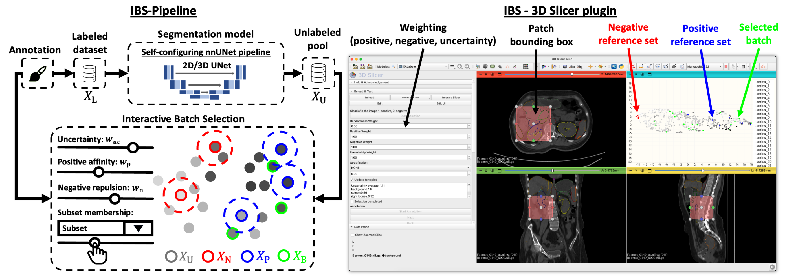

# IBS: Interactive Batch Selection for Medical Image Segmentation



This repository contains the code used for the experiments presented in
**“IBS: Interactive Batch Selection for Medical Image Segmentation”** for the
MICCAI 2026 Workshop on Human-AI Collaboration (HAIC).

An updated, user-friendly version will be available soon.

## Installation

The environment uses **Python 3.10**, **PyTorch 2.1.2**, and **CUDA 11.8**.
Run these commands from the repository root:

```bash
conda env create -f environment.yml
conda activate ibs
```

The environment targets systems with an NVIDIA GPU. For a CPU-only setup,
remove `pytorch-cuda` from `environment.yml` and install the appropriate
PyTorch build.

XALabeler runs within 3D Slicer and must be installed separately.

### Bundled nnU-Net

IBS includes the modified nnU-Net implementation used in the experiments at
`src/tools/nnUNet/nnUNet`. There is no need to clone nnU-Net separately.

To install or reinstall the bundled package manually:

```bash
python -m pip install -e ./src/tools/nnUNet/nnUNet
```

## Configure data paths

Copy the example configuration and update the paths for your system:

```bash
cp configs/ibs.example.json configs/ibs.local.json
```

Relative paths are resolved from the directory containing the configuration
file. The `{dataset}` placeholder is replaced with the value supplied to
`--dataset`.

Path settings are applied in this order, from highest to lowest precedence:

1. Command-line arguments
2. Environment variables
3. Configuration file
4. Repository defaults

To view all available arguments:

```bash
python src/IBS.py --help
```

Supported environment variables include:

- `IBS_RAW_DATA_DIR`
- `IBS_ACTIVE_DIR`
- `IBS_DATASET_DATA_DIR`
- `IBS_MODULES_DIR`
- `IBS_NNUNET_DIR`
- `IBS_MANUAL_DIR`
- `IBS_NNGEOMETRY_DIR`
- `nnUNet_raw`
- `nnUNet_preprocessed`
- `nnUNet_results`

For details about the nnU-Net variables, see the
[nnU-Net path configuration documentation](https://github.com/MIC-DKFZ/nnUNet/blob/master/documentation/set_environment_variables.md).

## Datasets

The code has been tested on the **AMOS**, **KiTS**, and **ASOCA** datasets.

Download the dataset you want to use and set `raw_data_dir` in
`configs/ibs.local.json`. The dataset directory must contain:

```text
<raw_data_dir>/
├── imagesTr/    # Input images
└── labelsTr/    # Corresponding segmentation masks
```

Medical images, annotations, trained models, local configuration files, and
XALabeler action lists are intentionally excluded from version control. Before
sharing experiment artifacts, verify that they are properly de-identified and
that their licenses or data-use agreements permit redistribution.

## XALabeler

XALabeler is a 3D Slicer extension for interactive batch selection. Its
interface lets you select batches from a t-SNE plot, inspect image patches,
adjust IBS weights, and annotate selected samples.

Install it using the
[3D Slicer Extension Wizard](https://slicer.readthedocs.io/en/latest/user_guide/modules/extensionwizard.html).

### Server and local workflow

IBS typically trains nnU-Net on an HPC server, while interactive selection is
performed locally in 3D Slicer.

1. Copy the generated `data_manual` directory from the training server to the
   computer running 3D Slicer.
2. Update `XALabeler/settings_XALabeler.json` to reference that directory.
3. Open the installed XALabeler extension in 3D Slicer.
4. Select and inspect batches, adjust IBS weights, and annotate samples.
5. Close 3D Slicer to save the results to `data_manual`.
6. Copy the updated directory back to the training server before continuing.

## Run an active-learning experiment

### 1. Initialize the experiment

Initialization analyzes the dataset, generates patches, and trains the initial
model:

```bash
python src/IBS.py \
  --config configs/ibs.local.json \
  --dataset AMOS \
  --dataset_name_or_id 500 \
  --func init
```

### 2. Select batches with XALabeler

Follow the XALabeler workflow above and copy the updated `data_manual`
directory back to the training server.

### 3. Run the next round

```bash
python src/IBS.py \
  --config configs/ibs.local.json \
  --dataset AMOS \
  --dataset_name_or_id 500 \
  --strategy IBS \
  --func al \
  --dim 3 \
  --configuration 3d_fullres \
  --label_manual true \
  --segauto true \
  --nnUNetTrainer nnUNetTrainer_ORGAN_300
```

Repeat interactive batch selection and training for subsequent rounds.

## Evaluation

Trained nnU-Net models and validation results are written to the configured
experiment output directory.

## Third-party software

The repository contains a modified nnU-Net snapshot. See
[`THIRD_PARTY_NOTICES.md`](THIRD_PARTY_NOTICES.md) and the bundled nnU-Net
license for attribution and licensing details.

## License

This project is distributed under the Apache License 2.0. See
[`LICENSE`](LICENSE).

## Contact

Bernhard Föllmer

Epione team, Inria, Université Côte d’Azur

Sophia Antipolis, France

[bernhard.follmer@inria.fr](mailto:bernhard.follmer@inria.fr)
